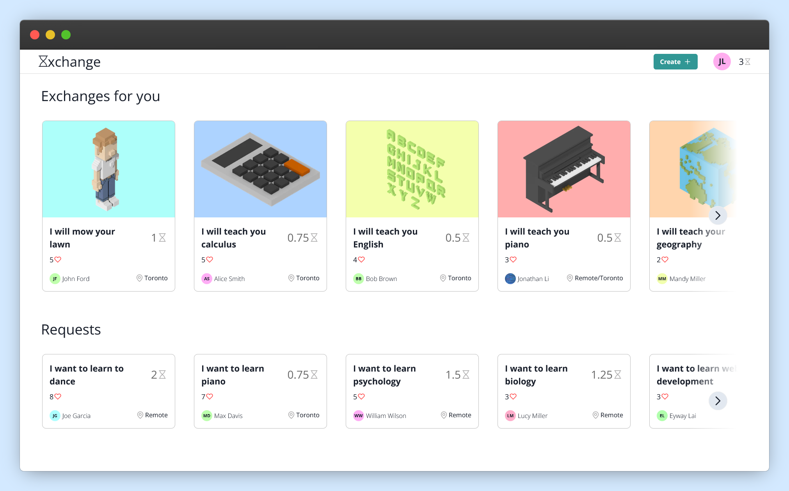

# Exchange: Time for everything



**currently live at [timexchange.tech](https://timexchange.tech)**

Σxchange is a web application where users can exchange time with other users. The concept is simple: users can exchange their own time or request others’ time through our system. Our application uses chronos, a multifaceted currency equating to one hour per unit, to standardize transactions between users. Users can spend their time to earn chronos and then spend it on services. Σxchange is designed to let users use time for everything!

Made for the [Hacky Winterland Hackathon](https://hackywinterland.devpost.com/), Σxchange is a project that is currently under development.

<br>

## Running locally

```bash
git clone https://github.com/MonliH/exchange.git
cd exchange
yarn install

# To start development server:
yarn dev

# To start production version:
yarn build
yarn start
```
